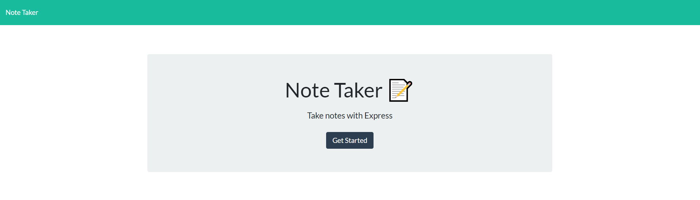
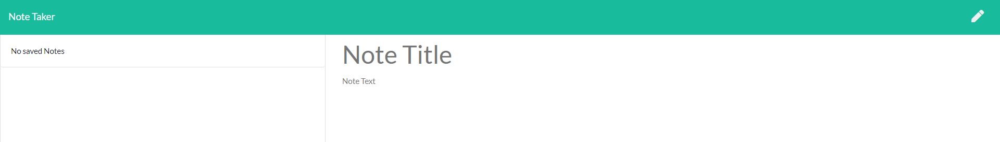
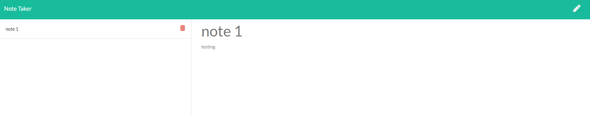

# 11 Express.js: Note Taker

## Description
This weeks assignment is to modify given starter code(front-end HTML,CSS,JS), by setting up a back-end express server and configure HTML,api routes to create a **Note Taker** application that allows the user to write and save notes.  The final product is deployed to Heroku.  The express router features functions that handles **Get**, **POST** and ** DELETE** requests:

### Get Request
The server responds incoming requests from the client, renders notes and the landing HTML page.

### Post Request
The server reads and returns data.  Submitted data are added to `db.json` file by clicking the save icon at the top of the page - a new note will be returned to the client.

### Delete request
The delete method allows user to delete notes by clicking on the delete button.

## Installation/Usage
- Clone repository to your local machine.
- Input `npm i` to install packages (cors,express,path,uuid) for the program. 
- Input `npm start` to run the application on local server. 
- Click on the deployed Heroku link to run the application live.
[Click here to deployed Heroku Link] (https://shrouded-badlands-27921.herokuapp.com)

## Link t Github repository 
[Click here] (https://github.com/marcuslau0903/10-Object-Oriented-Programming-Team-Profile-Generator)

## Screenshot of the Note Taker Application

